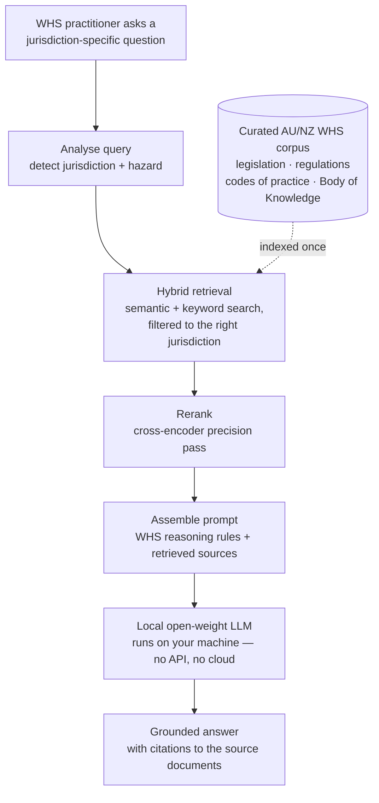

<div align="center">

# SafetyLM

### The open-source AI that Work Health & Safety practitioners can actually trust.

*Grounded in Australian and New Zealand WHS law. Aligned to the frameworks professionals actually use. Transparent about every source.*


</div>

---

> **SafetyLM is a domain-specialised AI reasoning system for WHS practitioners across Australia and New Zealand** — grounded in primary legislation, regulations, codes of practice, and safety science. It is *not* a general-purpose chatbot with a safety prompt. It is a purpose-built tool that reasons in the language WHS professionals actually use, and shows its work.

---

## The problem

When a WHS practitioner turns to a general-purpose AI to interpret legislation, draft a SWMS, or analyse an incident, the tool fails in ways a non-expert would never catch:

- 🚫 **Hallucinated citations** — confidently inventing section numbers and regulations that don't exist.
- 🗺️ **Jurisdiction confusion** — quoting NSW regulations in a Western Australian context, where the law is fundamentally different.
- 📋 **Generic advice** — a one-size-fits-all "hierarchy of controls" template where a bowtie analysis or ICAM investigation was needed.
- ⚖️ **Model-vs-jurisdiction blindness** — unable to distinguish the model WHS Act from the specific variations each state and territory enacted.

In a safety-critical domain, a confident wrong answer isn't a minor annoyance — it erodes trust and can contribute to poor decisions. **No open-source AI is built and grounded specifically for AU/NZ WHS practice. SafetyLM exists to fill that gap.**

---

## The vision

> SafetyLM is the open-source AI reasoning system that WHS practitioners across Australia and New Zealand can **actually trust** — grounded in primary legislation, aligned to domain frameworks, and transparent about its sources.

Every answer traces back to a real document, in the right jurisdiction, with a currency caveat. When the system can't find a grounded source, it says so — rather than generating something plausible. That honesty *is* the product.

---

## What makes it different

| | Principle | What it means in practice |
|---|---|---|
| 🎯 | **Domain depth over breadth** | One regulatory environment done properly beats ten done shallowly. AU/NZ WHS, end to end. |
| 🔍 | **Source transparency** | Every response surfaces which document, which jurisdiction, and when it was last reviewed. No black box. |
| 🗺️ | **Jurisdiction precision** | The right jurisdiction is a first-class filter, not an afterthought. A Victorian query retrieves VIC instruments — and flags that Victoria is the one jurisdiction outside the harmonised model WHS scheme. |
| 🧠 | **Framework alignment** | Reasons *through* ICAM, bowtie, critical-control logic, and the WHS duty hierarchy — not just *about* them. |
| 🛡️ | **Conservative confidence** | Calibrated to express uncertainty rather than confabulate. "I couldn't find a specific source" is a feature. |
| 📂 | **Open methodology** | Corpus criteria, retrieval design, and the evaluation benchmark are all published so others can reproduce, critique, and improve. |

---

## How it works

SafetyLM uses **Retrieval-Augmented Generation (RAG)**: instead of trusting a model's memory, it retrieves the relevant WHS documents at query time and reasons over what's actually in front of it — then cites them.



Everything runs **locally and open** — no API dependency, no per-query cost, full data sovereignty. The corpus is built only from **primary sources** a practitioner or court would recognise as authoritative.

> **What the target experience looks like** *(illustrative — this is what we're building toward):*
>
> **You ask:** *"What are a PCBU's primary duties for psychosocial hazards in NSW?"*
>
> **SafetyLM answers** with the duty under the *Work Health and Safety Act 2011 (NSW)*, notes that "health" expressly includes psychological health, references the relevant Code of Practice — and ends with a **Sources** block linking each document, plus a reminder to verify currency with SafeWork NSW.

---

## Under the hood: how the math works

SafetyLM's reliability comes from turning *"which documents are relevant?"* into a **geometry problem** — one a computer can solve exactly and repeatably. Here it is in numbers.

**1 · Text becomes coordinates (embeddings).**
Each source document is split into overlapping **chunks** of ~512 tokens (≈380 words) with a 64-token overlap, so a clause split across a boundary keeps its context. SafetyLM's corpus is currently **616 catalogued documents → 20,451 chunks**. An *embedding model* (primary candidate `bge-m3`) converts every chunk into a **vector** — a list of ~1,024 numbers that places its *meaning* as a point in high-dimensional space. Chunks about similar things land near each other even when they share no words: *"PCBU obligations for psychological safety"* sits close to *"person conducting a business or undertaking duties for psychosocial hazards."*

**2 · Relevance = closeness (cosine similarity).**
Your question is embedded into the *same* space, then scored against every chunk by **cosine similarity** — the cosine of the angle between two vectors:

```
              A · B
cos(θ)  =  ─────────────
            ‖A‖ · ‖B‖
```

It runs from **1.0** (identical meaning) to **0.0** (unrelated); relevant WHS matches typically score **0.7–0.9**. This is why SafetyLM surfaces the right clause even when your wording differs from the legislation's.

**3 · Two searches, because law is also about exact words (hybrid retrieval).**
Pure meaning-search can miss literal terms — ask for *"section 19"* and it may not surface that exact number. So SafetyLM runs **hybrid retrieval**: the semantic (dense-vector) search *and* a keyword search (**BM25**, which rewards exact term matches and rare, information-rich words), then fuses the two rankings. Meaning finds paraphrases; BM25 nails section numbers, regulation IDs, and defined terms.

**4 · The funnel: 20,451 → filter → ~50 → 6.**

```
   20,451 chunks
        │   metadata filter   (jurisdiction ∈ {NSW, FED}, currency = CURRENT, …)
        ▼
   candidate pool
        │   hybrid retrieve — cast a wide net (optimise for recall)
        ▼
   ~50 candidates
        │   rerank — a cross-encoder reads (your question + each chunk) TOGETHER
        ▼           and scores true relevance (optimise for precision)
      top 6   ──▶   into the model's context, with citations
```

The **metadata filter** is what makes jurisdiction first-class: a Victorian query never even *considers* NSW-only chunks. The **reranker** is the precision pass — the first stage maximises *recall* (find everything possibly relevant), the reranker maximises *precision* (float the truly-relevant few to the top). A reranker can only re-order what the first stage found, which is exactly why the net is cast wide (~50) before narrowing to 6.

**5 · Why this beats a chatbot's memory.**
A plain LLM answers from a lossy, uncited memory of its training data. SafetyLM instead hands the model **six real, current, in-jurisdiction excerpts** and asks it to reason over *those* — so every claim traces to a source, and *"I couldn't find it"* becomes a possible, honest answer. The math above is the guarantee that those six excerpts are the right ones.

*Plain-language explainers of each concept — tokens, embeddings, cosine similarity, HNSW, precision vs recall — live in [`docs/learning/concepts.md`](docs/learning/concepts.md).*

---

## Who it's for

**Primary** — WHS consultants doing cross-jurisdictional research · early-career practitioners who need a reliable starting point · small businesses without a dedicated safety team · students working toward Cert IV, Diploma, or postgraduate WHS qualifications.

**Secondary** — WHS software vendors embedding domain AI · researchers studying AI in occupational health & safety · organisations wanting to self-host a WHS AI on their own infrastructure.

---

## The plan

SafetyLM is being **built in public**, phase by phase. Each phase has explicit acceptance criteria in [`docs/06-phased-roadmap.md`](docs/06-phased-roadmap.md).

| Phase | What it delivers | Status |
|---|---|---|
| **0 · Planning & documentation** | Full architecture, corpus, evaluation, and governance design — a persistent project brief | ✅ **Complete** |
| **1 · Corpus build** | A catalogued **616-document manifest** of AU/NZ WHS sources, with a download → extract → chunk pipeline (20,451 metadata-tagged chunks) | 🏗️ **In progress** |
| **2 · Embedding & vector store** | Semantic + keyword retrieval with jurisdiction filtering, validated for precision | ⬜ Planned |
| **3 · RAG pipeline & system prompt** | First working end-to-end SafetyLM: query in → grounded, cited answer out | ⬜ Planned |
| **4 · Benchmark evaluation** | A **500-question WHS benchmark** + scored results against baselines, published openly | ⬜ Planned |
| **5 · Interface & public launch** | A clean chat interface, install guide, and a public release anyone can run | ⬜ Planned |
| **6 · v2 — fine-tuning** *(future)* | Fine-tuned weights & LoRA adapters that internalise WHS reasoning patterns | 🔭 Future |

### A contribution to the field, regardless of outcome

A standout deliverable is the **SafetyLM-Eval benchmark**: 500+ validated WHS questions with ground-truth answers, published openly under CC BY 4.0. Any WHS AI — open or commercial — can be measured against it. That makes it a genuine contribution to the space *independent of how SafetyLM itself performs*.

---

## Architecture at a glance

| Layer | Approach |
|---|---|
| **Model** | Local, open-weight LLM (Apache-2.0 / MIT licensed), **selected by benchmark, not assumed** — see [`docs/02-model-selection.md`](docs/02-model-selection.md) |
| **Retrieval** | Hybrid (semantic + keyword) search with jurisdiction metadata filtering, then a cross-encoder reranker |
| **Corpus** | Primary AU/NZ WHS sources only; every chunk carries jurisdiction, document type, and currency metadata |
| **Runtime** | Runs entirely on local hardware via Ollama — no cloud, no API keys |
| **Evaluation** | A published 500-question benchmark gates every change to corpus, retrieval, or prompt |

Deep dives live in [`docs/`](docs/) (see the index below).

---

## What SafetyLM is **not**

Setting expectations is part of earning trust:

- ❌ **Not** a replacement for professional WHS advice or a qualified practitioner.
- ❌ **Not** a legal interpretation service.
- ❌ **Not** a general-purpose chatbot.
- ❌ **Not** a compliance checker that guarantees legislative currency — the corpus has a published date, and users must verify the current version with the regulator.

These are design decisions that shape how the system responds, not disclaimers buried in fine print.

---

## Documentation

| Document | Purpose |
|---|---|
| [`docs/00-vision.md`](docs/00-vision.md) | Vision, goals, users, and success criteria |
| [`docs/01-architecture.md`](docs/01-architecture.md) | System architecture and data flow |
| [`docs/02-model-selection.md`](docs/02-model-selection.md) | Base model strategy and benchmark shortlist |
| [`docs/03-corpus-strategy.md`](docs/03-corpus-strategy.md) | Corpus scope, source taxonomy, and metadata schema |
| [`docs/04-rag-pipeline.md`](docs/04-rag-pipeline.md) | Retrieval pipeline, reranking, and system prompt design |
| [`docs/05-evaluation.md`](docs/05-evaluation.md) | Benchmark design and scoring methodology |
| [`docs/06-phased-roadmap.md`](docs/06-phased-roadmap.md) | Phase-by-phase build plan with acceptance criteria |
| [`docs/07-distribution.md`](docs/07-distribution.md) | Distribution and community launch strategy |
| [`docs/08-governance.md`](docs/08-governance.md) | Licensing, liability, attribution, and contribution rules |
| [`docs/research/`](docs/research/) | Dated, source-cited research snapshots behind key decisions |
| [`docs/learning/`](docs/learning/) | Plain-language concept explainers, annotated to each build phase |

---

## Get involved

SafetyLM is open to contribution in three areas:

- 📚 **Corpus** — propose missing AU/NZ WHS source documents (with complete metadata and a verified URL).
- 🧪 **Evaluation** — contribute jurisdiction- or hazard-specific questions to the benchmark dataset.
- 💻 **Code** — improve the pipeline, retrieval, or interface.

If you're a WHS practitioner, your domain judgement is the most valuable contribution of all. Open an issue to start a conversation. *(Full guidelines arrive with the public launch in Phase 5.)*

---

## Responsible use & disclaimer

> **SafetyLM is an AI research tool for information purposes only.**
>
> It is not a substitute for professional WHS advice, legal advice, or the judgement of a qualified work health and safety practitioner.
>
> SafetyLM's responses are grounded in publicly available documents as of the corpus version date. Legislative instruments are amended regularly — **always verify currency with the relevant regulator** before relying on any legislative provision cited.
>
> SafetyLM's author and contributors accept no liability for decisions made in reliance on SafetyLM outputs.

---

## Licence

- **Code** — [Apache 2.0](LICENSE)
- **Documentation & benchmark dataset** — [CC BY 4.0](DATA-LICENSE.md)
- **Base model weights** — obtained by users directly from the model provider under that provider's own licence.

Corpus source documents remain under their original Crown copyright / open-access terms and are not relicensed; attribution is preserved per [`docs/08-governance.md`](docs/08-governance.md).

---

<div align="center">

**Built by [Avneet (Neet) Singh](https://github.com/whosneet)** — WHS practitioner (COHSProf), building the tool he wanted to exist.

*Grounded. Jurisdiction-aware. Cited. Open.*

</div>
